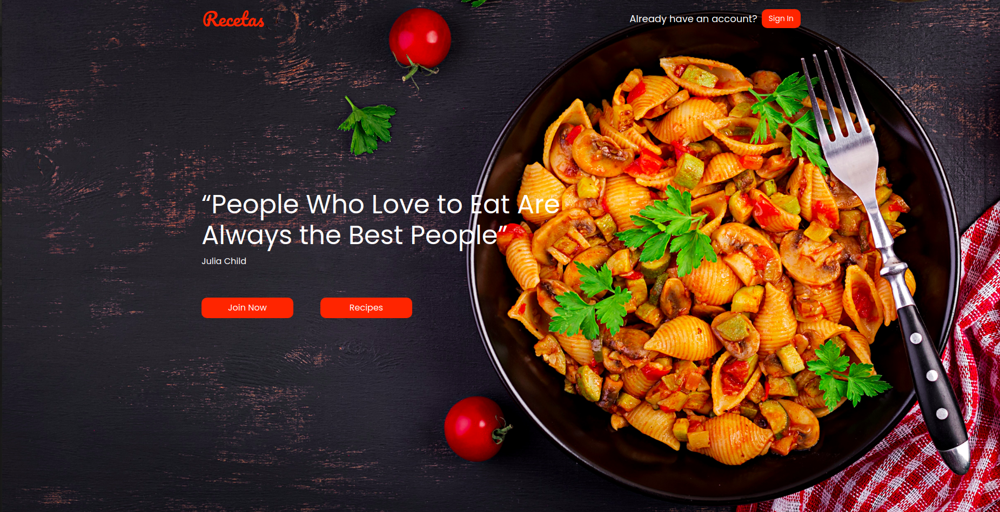
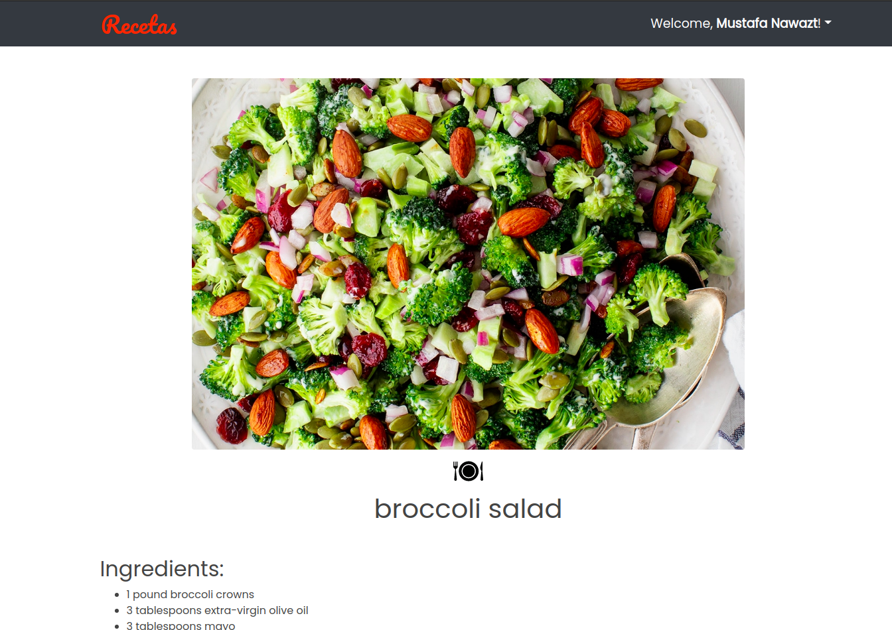

## Recetas

Recetas is a fully responsive, feature-rich and beautifully designed ReactJS theme for recipes. This app is perfect for people to share cooking knowledge with complete information. Built with ReactJS, Firebase for the database, ContextAPI for state management, and Bootstrap for styling. Fully responsive.

## Project Status

This project is Completed as v1. Users can Sign up/in, Create, and delete recipes.
Other suggested Functionality is welcomed! Just fork and work!

## Project Screen Shot(s)

## Installation and Setup Instructions

Clone down this repository. You will need `node` and `npm` installed globally on your machine.

Installation:

`npm install`

To Start Server:

`npm start`

To Visit App:

`localhost:3000`

## Reflection

This was one week long project built during Weekends. Project goals included using technologies learned up until this point and familiarizing myself with documentation for new features.

Originally I wanted to build an application that allowed users to add their recipes in one organized place so they can never lose or forget and share it with others. I started this process by using the `create-react-app` boilerplate, then adding `react-router` and `contextAPI`.
